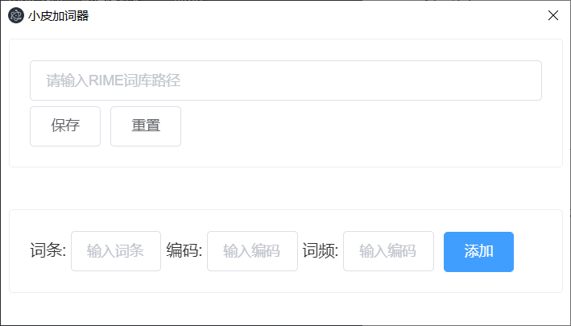

# rime-add-words
RIME加词器

electron + vite2

#### 使用教程

在windows上需要安装到c盘，路径需要把盘符去掉

D:\notes\learn-nodejs\electron\rime-add-words => \notes\learn-nodejs\electron\rime-add-words 

如果不去盘符，是无法加词的

#### 截图

